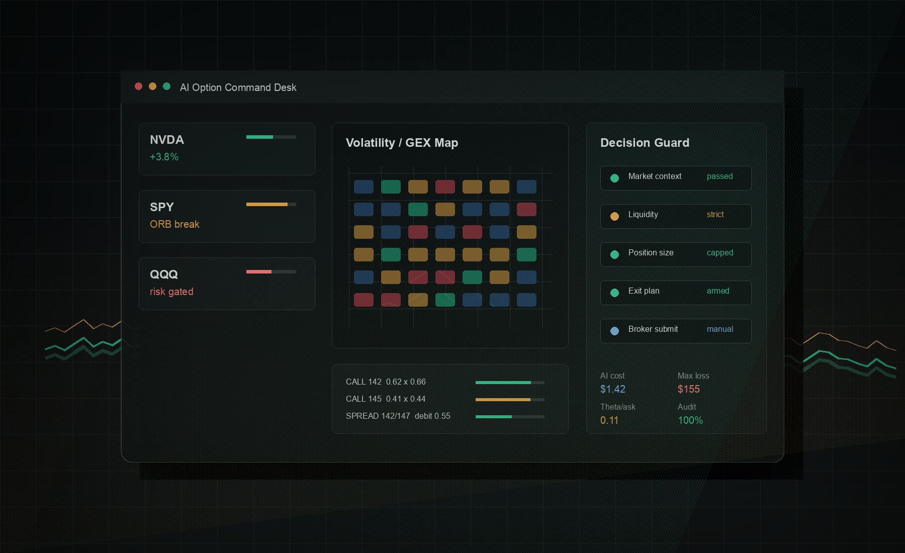

# AIOption

[](https://github.com/khakhasshi/AIOption/actions/workflows/ci.yml)
[](https://www.python.org/)
[](https://react.dev/)
[](LICENSE)

[中文](README.md) | English

AIOption is a local-first research workbench for US equity options. It connects market and option-chain analysis, volatility and dealer-exposure context, strategy construction, opportunity monitoring, broker execution, software risk controls, and post-trade review in one auditable workflow.

> **Risk warning:** This Alpha software is for research and workflow validation. It is not investment advice and does not promise returns. Options can lose their entire value quickly. Broker and automated-trading APIs are disabled by default.



## What It Does

- Parses natural-language theses into symbol, direction, DTE, strategy-family, and risk constraints.
- Combines daily and intraday structure, VWAP, ORB, RVOL, IV/RV, IV Rank, volume profile, and GEX.
- Scores option candidates with bid/ask, volume, open interest, IV, Greeks, spread quality, and executability.
- Supports single-leg, vertical, credit spread, straddle, strangle, collar, covered call, cash-secured put, calendar, diagonal, PMCC, iron condor, and butterfly structures.
- Runs watchlists, scheduled scans, conditional triggers, opportunity timelines, notifications, and post-trade reviews.
- Integrates ThetaData, yfinance, Longbridge, Alpaca, and uSMART through separate market-data and broker boundaries.
- Uses SQLite for a simple local setup or Postgres and Redis for split web/worker deployments.

## Safe Defaults

Fresh installations use research mode. Broker APIs, trading schedulers, automated-trading schedulers, and order monitors are all off. Docker publishes services only on `127.0.0.1`, and Git ignores credentials, account state, databases, reports, and downloaded data.

Real-money use requires an independent review of authentication, idempotency, partial-fill handling, risk limits, emergency flattening, and broker reconciliation. See [the trading safety specification](docs/trading-risk-and-safety-spec.md).

## Quick Start

### Docker

```bash
git clone https://github.com/khakhasshi/AIOption.git
cd AIOption
cp .env.example .env
docker compose up -d --build
curl http://127.0.0.1:7001/api/health
```

Open `http://127.0.0.1:7001`.

### Local Development

Python 3.12 and Node.js 22 are recommended.

```bash
python3.12 -m venv .venv
.venv/bin/pip install -r requirements-dev.txt
cp .env.example .env

cd web && npm ci && npm run build && cd ..
PYTHONPATH=. .venv/bin/python -m uvicorn ai_option_scanner.web_api:app \
  --host 127.0.0.1 --port 7001
```

AI is optional. A no-LLM CLI scan can be run with:

```bash
PYTHONPATH=. .venv/bin/python -m ai_option_scanner.cli --no-ai "Scan QQQ option structures"
```

Configuration templates and provider variables are documented in [.env.example](.env.example). Configure authentication before exposing the service to a network.

## Explicit Trading Opt-In

Start with a paper account. These environment switches are additional to user permissions, UI configuration, and strategy risk gates:

```bash
AI_OPTION_ENABLE_BROKER_API=true
AI_OPTION_ENABLE_TRADING_SCHEDULER=true
AI_OPTION_ENABLE_AUTO_TRADE_SCHEDULER=true
AI_OPTION_ENABLE_ORDER_MONITOR=true
```

Never run automated trading without the order monitor, and never run the same scheduler on multiple workers unless distributed ownership is intentionally configured.

## Project Boundary

This repository contains only the AIOption application. OptionWorkstation, the no-LLM rule trader, and the historical backtester remain separate projects. Market datasets, production databases, account caches, private reports, real order records, and provider credentials are intentionally excluded.

## Verification

```bash
PYTHONPATH=. .venv/bin/python -m pytest
PYTHONPATH=. .venv/bin/python scripts/check_api_docs.py
PYTHONPATH=. .venv/bin/python scripts/check_repository_hygiene.py
cd web && npm ci && npm run build
docker compose config --quiet
docker build -t aioption:local .
```

Research scripts use optional dependencies from `requirements-research.txt`.

## Contributing

Read [CONTRIBUTING.md](CONTRIBUTING.md), [SECURITY.md](SECURITY.md), and [CODE_OF_CONDUCT.md](CODE_OF_CONDUCT.md) before opening a pull request. Changes to execution, risk controls, or data semantics must include failure scenarios, tests, and rollback notes.

Copyright 2026 Jiang Jingzhe. Licensed under [Apache-2.0](LICENSE). Third-party market data and SDKs remain subject to their providers' terms.
