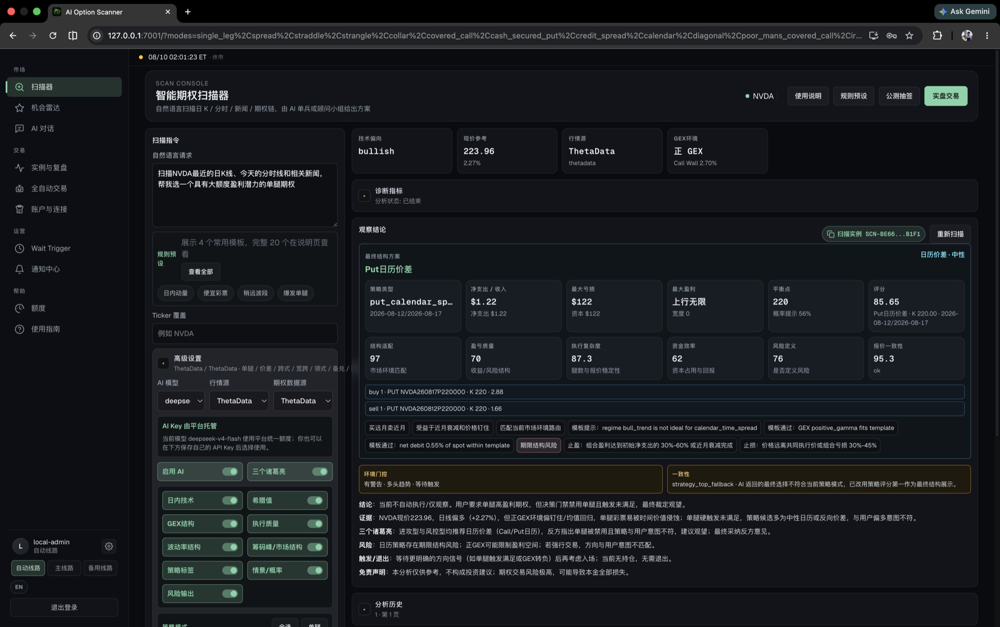
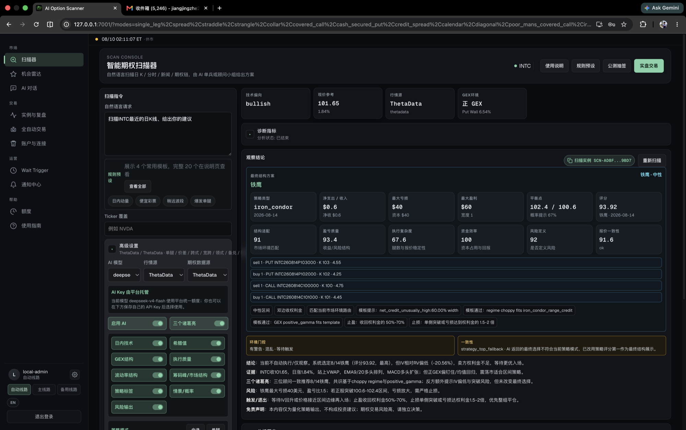
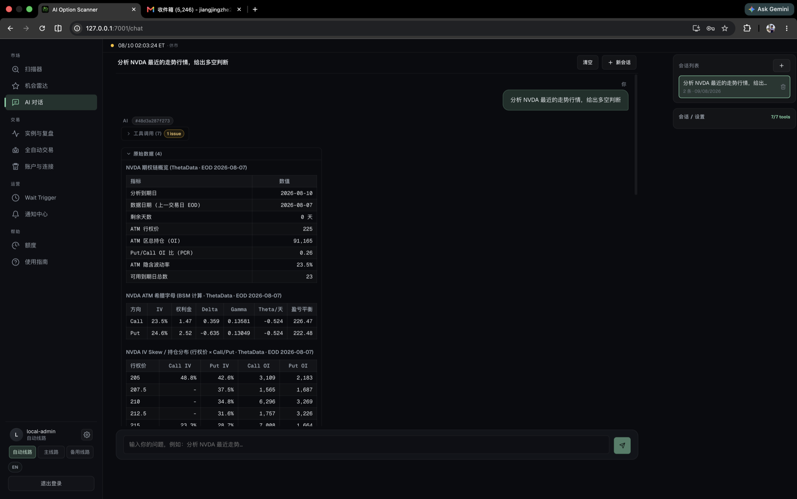
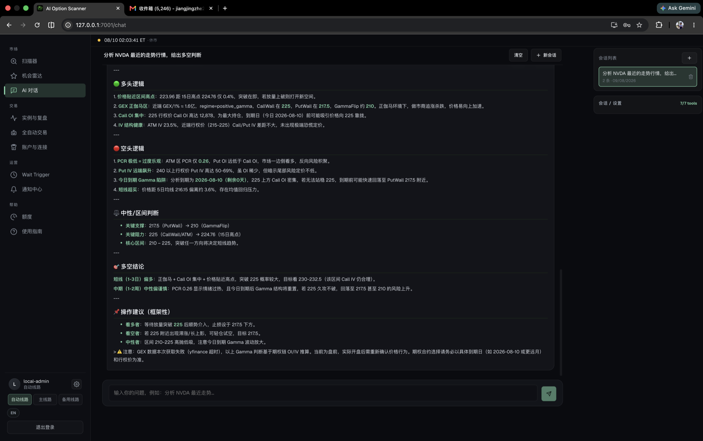

# AIOption

[](https://github.com/khakhasshi/AIOption/actions/workflows/ci.yml)
[](https://www.python.org/)
[](https://react.dev/)
[](https://fastapi.tiangolo.com/)
[](LICENSE)

[中文](README.md) | English

**AIOption is a local-first, evidence-driven workbench for researching and trading US equity options.**

AIOption connects natural-language scans, stock and option-chain data, implied and realized volatility, dealer exposure, strategy construction, AI review, broker execution, software risk controls, and post-trade analysis. Each decision records its data, structure rationale, maximum risk, and invalidation conditions instead of returning an unsupported trade call.

> **Risk warning:** This Alpha software supports research, decision review, and workflow validation. It does not provide investment advice. Options can lose their entire value quickly. The public source release disables broker and automated-trading APIs by default. You must audit every configuration and accept responsibility for any live use.

## Turn one request into a reviewable decision

AIOption uses a three-stage workflow:

1. **State an intent**: Describe the symbol, market view, time horizon, or preferred strategy
2. **Freeze the evidence**: Preserve timestamps, option chains, Greeks, implied volatility (IV), open interest (OI), gamma exposure (GEX), tool calls, and source tables
3. **Form a decision**: List supporting evidence, counter-evidence, key levels, invalidation conditions, structure risk, and execution gates

### 1. Convert a market view into a candidate structure



The request in this screenshot asks AIOption to review NVDA daily and intraday price action, check recent news, and find a single-leg option with large profit potential. The result includes more than a directional label:

- The underlying trades at `223.96`, the technical bias is `bullish`, ThetaData supplies the quote, and the GEX regime is positive
- The selected candidate is a put calendar spread with about `$122` of net debit and maximum loss, a `220` break-even reference, and an `85.65` score
- Separate scores cover structural fit, payoff quality, execution complexity, capital efficiency, risk definition, and quote consistency
- Every leg includes its side, contract, strike, expiration, and quote, followed by profit, loss, and term-structure rules
- Multi-role AI disagreement and a mismatch between the requested strategy and the selected template remain visible

The final state is still observation-only. A high candidate score does not mean that every decision gate passed. AIOption treats counter-evidence and a no-trade outcome as first-class results.

#### Compare a defined-risk iron condor



The scanner can also construct and review multi-leg range trades. In this screenshot, INTC trades at `101.65`. The technical bias is `bullish`, and ThetaData plus a positive GEX regime support a range-bound hypothesis. AIOption builds an iron condor expiring on `2026-08-14` and lists all four put and call legs.

- Net credit is about `$0.60` per share, or `$60` per standard contract group
- Maximum profit is `$60`, and maximum loss is `$40`
- Break-even prices are `100.6` and `102.4`, with an approximate reward-to-risk ratio of `1.5:1`
- The total score is `93.92`, with `91` for structural fit, `93.4` for payoff quality, `92` for risk definition, and `100` for capital efficiency
- Warnings identify low IV relative to realized volatility, a mixed regime, and disagreement between the AI output and the active strategy template

The result remains in a wait or observation state despite its defined loss and high score. Candidate scores rank alternatives. Regime gates, consistency checks, and entry conditions determine whether execution can continue.

### 2. Inspect source evidence before the AI conclusion



The AI chat is connected to the same market-data tools as the scanner. For the request to analyze NVDA and provide a bull or bear view, the tool chain first freezes and displays ThetaData evidence:

- The source date is the previous session end of day (EOD), `2026-08-07`, and the analyzed expiration is `2026-08-10`
- The at-the-money (ATM) strike is `225`, ATM-area OI is `91,165`, and the put-to-call OI ratio is `0.26`
- ATM call IV is `23.5%`, and put IV is `24.6%`, alongside premium, Delta, Gamma, daily Theta, and break-even values
- IV skew and call or put OI remain grouped by strike in the source table

Tool calls, source dates, and raw tables stay visible. You can distinguish live data, prior-session EOD data, and locally estimated fields before accepting the model's interpretation.

### 3. Keep uncertainty and invalidation conditions visible



After collecting the evidence, AIOption separates the same snapshot into bullish evidence, bearish evidence, a neutral range, and an action framework:

- Bullish evidence includes price near a recent high, a positive Gamma regime, and concentrated `225` call OI
- Bearish evidence includes a `0.26` put-to-call ratio, higher near-term put IV, and expiration-day Gamma risk
- Resistance sits near `225`; support sits near `217.5` and the `210` Gamma Flip area
- The short-horizon view is bullish only after a volume-confirmed breakout, while the medium-horizon view remains neutral to cautious
- If a GEX or external quote tool fails, the answer identifies the data gap and requires a new check after the market opens

AIOption does not treat the large language model (LLM) as a signal generator. Every directional conclusion needs evidence, counter-evidence, and invalidation conditions. When inputs are incomplete, no trade can be the correct result.

## Map each decision stage to a system capability

The workbench keeps research, risk, execution, and audit evidence connected:

| Decision stage | Capability |
|---|---|
| Intent parsing | Extract symbol, direction, days to expiration (DTE), strategy family, and risk preference from natural language |
| Market evidence | Daily and intraday prices, volume-weighted average price (VWAP), opening range breakout (ORB), relative volume (RVOL), moving averages, volume profile, and news |
| Option evidence | Option chains, bid and ask, volume, OI, IV, Greeks, skew, term structure, and GEX |
| Strategy construction | Single leg, vertical spread, credit spread, straddle, strangle, collar, covered call, cash-secured put, calendar, diagonal, poor man's covered call, iron condor, and butterfly |
| Risk gates | Multi-leg net price, capital usage, maximum loss, quote freshness, partial fills, and uncovered-leg risk |
| AI review | Single-model analysis or multi-role review by offensive, risk, counterargument, and moderator roles |
| Automation | Watchlists, recurring scans, Wait Trigger, opportunity radar, notifications, and trade instances |
| Auditability | Tool traces, source data, orders, fills, capital snapshots, exit reasons, and post-trade reviews |

### Separate market data from broker execution

AIOption assigns each provider a specific responsibility:

| Responsibility | Implementation |
|---|---|
| Stock and option research data | ThetaData first, with yfinance or Longbridge where configured |
| Greeks | Provider fields or local Black-Scholes estimates |
| GEX and volume profile | Calculated from option chains, OI, IV, and trade structure |
| AI provider | DeepSeek by default, plus OpenAI-compatible providers |
| Broker execution | Longbridge, Alpaca, and uSMART adapters |
| State storage | SQLite for local runs; Postgres and Redis in Docker |

Market data and broker execution are separate paths. Treat the active broker response as the authority for order, cancellation, and close status. Market data never proves that an order filled.

## Run AIOption with Docker

Install Docker Engine 24 or later with Docker Compose v2, then run:

```bash
git clone https://github.com/khakhasshi/AIOption.git
cd AIOption
cp .env.example .env
docker compose up -d --build
curl http://127.0.0.1:7001/api/health
```

Open [the local AIOption service](http://127.0.0.1:7001). The default configuration supports local research but keeps broker and trading APIs unavailable.

Use the reusable local administrator from `.env.example`:

```text
Username: local-admin
Password: AIOption-Local-Admin-2026!
```

This account can access analysis, trading pages, administrator controls, and unrestricted local quotas. Server-level switches for broker APIs, schedulers, automated trading, and order monitoring remain off. Use this public password only while the service binds to `127.0.0.1`. Replace the username, password, `AI_OPTION_AUTH_SECRET`, and `AI_OPTION_CREDENTIAL_SECRET` before exposing the service to a local network or the internet.

### Run a local development server

Install Python 3.12 and Node.js 22, then create the environment and build the frontend:

```bash
python3.12 -m venv .venv
.venv/bin/pip install -r requirements-dev.txt
cp .env.example .env

cd web
npm ci
npm run build
cd ..

PYTHONPATH=. .venv/bin/python -m uvicorn ai_option_scanner.web_api:app \
  --host 127.0.0.1 --port 7001
```

Run a command-line interface (CLI) scan with or without AI:

```bash
PYTHONPATH=. .venv/bin/python -m ai_option_scanner.cli \
  --no-ai "Scan QQQ option structures"
PYTHONPATH=. .venv/bin/python -m ai_option_scanner.cli \
  --council "Analyze NVDA trend-spread opportunities"
```

## Configure models and data sources

Store sensitive values in a local `.env` file, the encrypted server credential store, or a secret manager. Use [.env.example](.env.example) as the configuration template.

### Configure DeepSeek or another AI provider

AI is optional. The default model is DeepSeek V4 Flash with thinking mode disabled. You can also configure another OpenAI-compatible provider.

```bash
DEEPSEEK_API_KEY=your_api_key_here
DEEPSEEK_MODEL=deepseek-v4-flash
```

### Configure ThetaData

Sign in as an administrator. Open **Accounts and connections**, then use the **ThetaData data source** section to save, update, delete, or test the credentials. The backend encrypts stored credentials, and the frontend displays only a masked email address. Scanner, AI chat, trade instances, and post-trade review reuse the same server-level configuration.

Environment variables and credential files take precedence over values saved from the frontend:

```bash
THETADATA_EMAIL=your_email_here
THETADATA_PASSWORD=your_password_here
# Or use THETADATA_CREDENTIALS_FILE=/run/secrets/thetadata_credentials
```

Your subscription tier controls endpoint access and historical depth. AIOption can estimate missing Greeks locally, but it keeps estimated values separate from provider fields. ThetaData Cloud can limit concurrent active sessions for one account, so do not run multiple deployments with the same credentials.

### Configure Longbridge

Save credentials per account in the interface, or use environment variables:

```bash
AI_OPTION_LONGBRIDGE_BACKEND=sdk
LONGBRIDGE_APP_KEY=your_app_key_here
LONGBRIDGE_APP_SECRET=your_app_secret_here
LONGBRIDGE_ACCESS_TOKEN=your_access_token_here
```

### Configure sign-in and OAuth

The local administrator works after you copy `.env.example`. Before network deployment, replace that public account and set long random values for `AI_OPTION_AUTH_SECRET` and `AI_OPTION_CREDENTIAL_SECRET`. Prefer a password hash over a plaintext password. See [the OAuth setup guide](docs/oauth-login-setup.md) for Google, Apple, and Turnstile configuration.

Generate a password hash with:

```bash
PYTHONPATH=. python - <<'PY'
from ai_option_scanner.app_auth import hash_password
print(hash_password("replace_this_password"))
PY
```

## Keep trading disabled by default

New installations run in research mode:

- `live_enabled=false`
- `AI_OPTION_ENABLE_BROKER_API=false`
- Trading scheduler, automated-trading scheduler, and order monitor switches remain `false`
- Docker binds web, Postgres, and Redis ports to `127.0.0.1`
- Git ignores `.env`, databases, account caches, reports, downloaded data, and key files

Before live trading, review authentication, paper-account behavior, order idempotency, maximum loss, partial-fill handling, emergency flattening, and independent broker reconciliation. Read [the trading risk and safety specification](docs/trading-risk-and-safety-spec.md).

### Opt in to broker execution

Start with a paper account. These switches do not replace `live_enabled`, the user's `can_trade` permission, or strategy risk gates:

```bash
AI_OPTION_ENABLE_BROKER_API=true
AI_OPTION_ENABLE_TRADING_SCHEDULER=true
AI_OPTION_ENABLE_AUTO_TRADE_SCHEDULER=true
AI_OPTION_ENABLE_ORDER_MONITOR=true
```

Do not start automated trading without the order monitor. Do not start the same scheduler on multiple workers.

## Understand the service architecture

The Docker deployment separates request handling from background work:

```text
React SPA
   |
   | HTTP / cookie session / SSE
   v
FastAPI web API
   |-----------------------------|
   v                             v
Postgres or SQLite          Redis queue/locks/cache
   |                             |
   v                             v
Domain services              Worker process
   |                             |
   | market data / AI            | schedulers / monitors
   v                             v
ThetaData / yfinance / Longbridge / brokers
```

The web process serves the API and React application. The worker consumes scan tasks and runs only the background services that you explicitly enable. The [project documentation](docs/) describes the state machines, data model, and API contracts.

## Keep related research projects separate

This repository contains only the AIOption application:

- `OptionWorkstation`: Real-time option analytics and historical replay
- `aioption-rule-trader`: No-LLM rule-trading experiments
- `aioption-trading-backtester`: Historical simulation and parameter research

The repository excludes market datasets, production databases, real order records, account caches, private reports, and provider credentials.

## Validate changes before contributing

Run the relevant checks before opening a pull request:

```bash
# Backend tests
PYTHONPATH=. .venv/bin/python -m pytest

# API documentation coverage
PYTHONPATH=. .venv/bin/python scripts/check_api_docs.py

# Repository and secret hygiene
PYTHONPATH=. .venv/bin/python scripts/check_repository_hygiene.py

# Frontend production build
cd web && npm ci && npm run build

# Docker configuration and image
docker compose config --quiet
docker build -t aioption:local .
```

Historical downloads and adaptive-entry research scripts need the optional dependencies in `requirements-research.txt`.

## Read the project documentation

- [Backend API reference](docs/backend-api-reference.md)
- [Data model and schema](docs/data-model-and-schema.md)
- [Market data API reference](docs/market-data-api-reference.md)
- [Frontend route and feature map](docs/frontend-route-feature-map.md)
- [Server-sent events and real-time status design](docs/sse-realtime-status-design.md)
- [Deployment runbook](docs/deployment-runbook.md)
- [Security policy](SECURITY.md)
- [Contribution guide](CONTRIBUTING.md)
- [Public-release readiness checklist](docs/OPEN_SOURCE_READINESS.md)

## Contribute to AIOption

Open an issue or pull request to contribute. Changes to execution, risk controls, or data semantics must include failure scenarios, test evidence, and rollback notes. Read [CONTRIBUTING.md](CONTRIBUTING.md) and [CODE_OF_CONDUCT.md](CODE_OF_CONDUCT.md) before submitting a change.

## Author and license

Jiang Jingzhe, 江景哲. Email: jiangjingzhe2004@gmail.com

The current release uses the [PolyForm Noncommercial License 1.0.0](LICENSE). It permits only the noncommercial purposes defined by the license. Contact jiangjingzhe2004@gmail.com for a separate commercial license.

Historical versions already released under Apache License 2.0 remain governed by that license. This change does not revoke previously granted rights. Read the [licensing history and commercial-use policy](LICENSING.md). Third-party market data and SDKs remain subject to their providers' terms.
