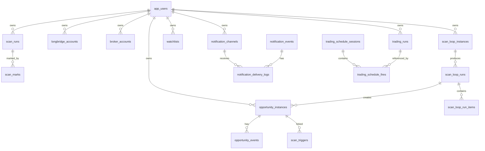

# Data Model And Schema

本文档描述 AI Option 当前核心数据模型、表关系和 JSON 字段边界。它用于前端重构、后端维护、数据库迁移和未来 Rust 重构。

## 1. 存储后端

生产默认：

- Postgres：业务主状态。
- Redis：扫描队列、分布式锁、共享缓存、限流。

本地兜底：

- SQLite：未配置 `AI_OPTION_DATABASE_URL` 时使用。

兼容原则：

- 表结构通过 `CREATE TABLE IF NOT EXISTS` 和 `ensure_column()` 演进。
- JSON 字段用 TEXT 存储，读写时由应用层解析。
- Rust 重构必须保持这些表和关键 JSON 字段兼容，逐步迁移。

## 2. 实体关系概览

`owner_id` 是租户隔离主键。启用登录后，后端会把 username 归一化为 owner id。

## 3. 认证和用户

### `app_users`

模块：`app_auth.py`

用途：

- 登录用户。
- 权限。
- 到期时间。
- 配额。

关键字段：

| 字段 | 说明 |
|---|---|
| `username` | 登录名 |
| `password_hash` | PBKDF2 hash |
| `can_analyze` | 分析权限 |
| `can_trade` | 实盘权限 |
| `is_admin` | 管理权限 |
| `expires_at` | 到期时间 |
| `max_daily_scans` | 每日扫描上限 |
| `max_daily_ai_scans` | 每日 AI 扫描上限 |
| `max_watchlists` | 股票池上限 |
| `max_scan_loop_instances` | 循环实例上限 |
| `max_notification_channels` | 通知渠道上限 |
| `max_longbridge_accounts` | Longbridge 账号上限 |

语义：

- `-1` 表示不限额。
- env 用户也会出现在用户列表中，但 `editable=false`。

## 4. AI Provider 和用量

### `ai_user_providers`

模块：`ai_provider_store.py`

用途：用户级 OpenAI-compatible provider。

关键字段：

- `owner_id`
- `name`
- `label`
- `base_url`
- `model`
- `api_key_enc`
- `temperature`
- `provider_type`
- `is_default`

### `ai_usage_events`

模块：`ai_usage_store.py`

用途：AI 调用审计、token 和成本统计。

关键字段：

- `owner_id`
- `provider`
- `model`
- `source_type`
- `source_id`
- `scan_id`
- `scan_loop_instance_id`
- `symbol`
- `request_role`
- `council_mode`
- `radar_scan`
- `status`
- `prompt_tokens`
- `prompt_cache_hit_tokens`
- `prompt_cache_miss_tokens`
- `completion_tokens`
- `reasoning_tokens`
- `total_tokens`
- `estimated_cost_cny`
- `estimated_cost_usd`
- `error`
- `created_at`

## 5. 账号和券商

### `longbridge_accounts`

模块：`account_store.py`

用途：Longbridge 账号和 SDK 凭证。

关键字段：

- `owner_id`
- `name`
- `label`
- `home_dir`
- `is_default`
- `identity_fingerprint`
- `session_status`
- `region`
- `identity_meta_json`
- `sdk_app_key_enc`
- `sdk_app_secret_enc`
- `sdk_access_token_enc`
- `sdk_app_key_suffix`
- `sdk_credentials_updated_at`

### `broker_accounts`

模块：`broker_store.py`

用途：模块化券商账号。当前支持 Alpaca。

关键字段：

- `owner_id`
- `broker`
- `name`
- `label`
- `api_key_enc`
- `api_secret_enc`
- `api_key_suffix`
- `paper`
- `is_default`
- `status`
- `status_meta_json`
- `last_used_at`

约束：

- Longbridge 不在该表创建，仍使用 `longbridge_accounts`。
- Alpaca 使用该表。

## 6. 分析扫描

### `scan_runs`

模块：`scan_store.py`

用途：自然语言分析实例。

关键字段：

- `id`
- `locator_id`，用户可见 `SCN-...`
- `owner_id`
- `status`
- `stage`
- `progress`
- `created_at`
- `updated_at`
- `query`
- `symbol`
- `ai_provider`
- `ai_provider_owner`
- `longbridge_account`
- `market_data_source`
- `use_ai`
- `council`
- `analysis_modules_json`
- `strategy_modes_json`
- `result_json`
- `payload_json`
- `charts_json`
- `error`
- `source_type`
- `source_id`
- `scan_loop_instance_id`

语义：

- 列表接口返回摘要。
- 详情接口返回完整 result/payload/charts。
- `market_data_source` 旧数据可能是 `longbridge`，新默认是 `thetadata`。

### `scan_marks`

模块：`observation_store.py`

用途：扫描星标、笔记和标签。

关键字段：

- `owner_id`
- `scan_id`
- `starred`
- `note`
- `tags_json`
- `updated_at`

## 7. 通知中心

### `notification_channels`

模块：`observation_store.py`

用途：通知渠道配置。

关键字段：

- `owner_id`
- `type`
- `label`
- `config_json`
- `enabled`
- `verified_at`
- `last_error`
- `last_test_at`
- `created_at`
- `updated_at`

敏感字段存在 `config_json` 中时必须加密或隐藏，API 不返回完整值。

### `notification_events`

用途：通知事件和重试状态。

关键字段：

- `owner_id`
- `channel_ids_json`
- `title`
- `body`
- `source_type`
- `source_id`
- `dedupe_key`
- `payload_json`
- `status`
- `attempts`
- `next_attempt_at`
- `last_error`
- `created_at`
- `sent_at`

### `notification_delivery_logs`

用途：每次投递请求审计。

关键字段：

- `owner_id`
- `event_id`
- `channel_id`
- `provider`
- `status`
- `attempt`
- `request_preview_json`
- `response_summary_json`
- `error`
- `created_at`

## 8. Trigger、股票池和雷达

### `scan_triggers`

用途：Wait Trigger 规则。

关键字段：

- `owner_id`
- `name`
- `symbol`
- `scan_id`
- `locator_id`
- `opportunity_id`
- `condition_json`
- `notification_channel_ids_json`
- `enabled`
- `status`
- `expires_at`
- `check_interval_seconds`
- `cooldown_seconds`
- `max_trigger_count`
- `trigger_count`
- `last_checked_at`
- `next_check_at`
- `last_triggered_at`
- `market_policy`
- `opening_grace_minutes`

### `watchlists`

用途：股票池。

关键字段：

- `owner_id`
- `name`
- `description`
- `symbols_json`
- `created_at`
- `updated_at`

### `scan_loop_instances`

用途：循环扫描配置。

关键字段：

- `owner_id`
- `watchlist_id`
- `name`
- `description`
- `status`
- `symbols_json`
- `schedule_json`
- `market_session`
- `market_data_source`
- `ai_provider`
- `use_ai`
- `council`
- `analysis_modules_json`
- `strategy_modes_json`
- `prompt_template`
- `prefilter_rules_json`
- `alert_rules_json`
- `alert_mode`
- `notification_channel_ids_json`
- `max_alerts_per_day`
- `max_ai_scans_per_day`
- `ai_scan_policy`
- `ai_scan_top_n`
- `ai_report_cache_json`
- `next_run_at`
- `last_run_at`
- `last_eod_review_date`
- `last_weekend_review_key`

### `scan_loop_runs`

用途：一次循环扫描运行。

关键字段：

- `owner_id`
- `instance_id`
- `status`
- `summary_json`
- `created_at`
- `completed_at`
- `error`

### `scan_loop_run_items`

用途：循环扫描中单标的明细。

关键字段：

- `owner_id`
- `run_id`
- `instance_id`
- `symbol`
- `status`
- `snapshot_json`
- `prefilter_result_json`
- `alert_result_json`
- `recommendation_json`
- `notification_event_ids_json`
- `scan_id`
- `created_at`

## 9. 机会实例

### `opportunity_instances`

用途：可持续追踪机会。

关键字段：

- `owner_id`
- `source_type`
- `source_id`
- `scan_loop_instance_id`
- `scan_id`
- `symbol`
- `contract_symbol`
- `strategy_type`
- `status`
- `title`
- `thesis`
- `ai_direction`
- `derived_direction`
- `legs_json`
- `payoff_json`
- `validation_json`
- `risk_plan_json`
- `notification_channel_ids_json`
- `followup_enabled`
- `followup_interval_seconds`
- `cooldown_seconds`
- `max_followup_alerts`
- `followup_alert_count`
- `last_checked_at`
- `next_check_at`
- `last_alert_at`
- `expires_at`
- `created_at`
- `updated_at`

### `opportunity_events`

用途：机会生命周期事件。

关键字段：

- `owner_id`
- `opportunity_id`
- `event_type`
- `title`
- `body`
- `payload_json`
- `created_at`

## 10. 实盘交易

### `trading_configs`

模块：`trading_store.py`

用途：每个 owner 的实盘配置。

关键字段：

- `owner_id`
- `config_json`
- `updated_at`

`config_json` 包含：

- broker / broker_account / longbridge_account。
- market_data_source。
- universe。
- prompt_template。
- top_n。
- strategy_modes。
- schedule profile / slots。
- risk limits。
- software stop/take profit。
- AI/council 配置。

### `trading_runs`

用途：交易实例。

关键字段：

- `id`
- `locator_id`，用户可见 `TRD-...`
- `owner_id`
- `status`
- `stage`
- `progress`
- `created_at`
- `updated_at`
- `config_json`
- `scan_results_json`
- `council_json`
- `selections_json`
- `orders_json`
- `error`
- `instance_json`
- `instance_version`
- `lifecycle_state`
- `protection_state`
- `instance_updated_at`

重要 JSON：

| JSON | 内容 |
|---|---|
| `config_json` | 本次运行使用的配置快照 |
| `scan_results_json` | 股票池扫描结果 |
| `council_json` | AI 决策过程 |
| `selections_json` | 最终选择 |
| `orders_json` | 订单和策略执行结果 |
| `instance_json` | 交易实例完整状态、风控、时间线、复盘 |

### `trading_capital_snapshots`

用途：账户资产、成交和资金曲线。

关键字段：

- `owner_id`
- `snapshot_date_et`
- `account_ref`
- `strategy_json`
- `assets_json`
- `executions_json`
- `created_at`

### `trading_schedule_sessions`

用途：多时段父会话。

关键字段：

- `owner_id`
- `trade_date_et`
- `profile_id`
- `session_id`
- `status`
- `config_hash`
- `started_at`
- `completed_at`
- `summary_json`

### `trading_schedule_fires`

用途：多时段 slot ledger。

关键字段：

- `owner_id`
- `trade_date_et`
- `profile_id`
- `slot_id`
- `session_id`
- `scheduled_time_et`
- `action`
- `gate_profile`
- `status`
- `run_id`
- `allocated_capital`
- `gate_result_json`
- `retry_count`
- `last_replay_at`
- `claimed_at`
- `fired_at`
- `error`

唯一性语义：

- 每个 owner/date/profile/slot 只应触发一次。
- stale `claimed` 可恢复为 `retrying`。

## 11. 公测抽签

### `beta_lottery_entries`

用途：报名记录。

关键字段：

- `lottery_name`
- `nickname`
- `contact`
- `entry_token`
- `is_winner`
- `assigned_username`
- `ip_location`
- `ip_geo_json`
- `route_mode`
- `created_at`

### `beta_lottery_slots`

用途：抽签名额。

关键字段：

- `lottery_name`
- `slot_index`
- `username`
- `password_hash`
- `assigned_entry_id`
- `assigned_at`

### `beta_lottery_ip_geo`

用途：IP 地理信息缓存。

## 12. Locator IDs

| 前缀 | 对象 | 用途 |
|---|---|---|
| `SCN-` | `scan_runs` | 分析实例可见 ID |
| `TRD-` | `trading_runs` | 交易实例可见 ID |
| `SES-` | schedule session | 多时段父会话 |

前端和客服应优先展示 locator id，但 API 要同时支持 uuid 和 locator。

## 13. JSON 字段演进规则

- 新字段必须向后兼容。
- 前端读取 JSON 字段必须容忍缺失。
- 不删除旧字段，先标记 deprecated。
- 数值字段缺失时显示 `--`，不要默认为 0，除非 0 有明确业务含义。
- 金额和 PnL 必须保留 basis/warnings。

## 14. 迁移规则

- SQLite -> Postgres 使用 `migrate_sqlite_to_postgres.py`。
- 新表和新列必须在对应 store 的 init 中创建。
- 迁移后必须检查核心表行数。
- 生产迁移前必须备份。
- 多服务器必须停止或冻结 worker，避免迁移时写入冲突。
