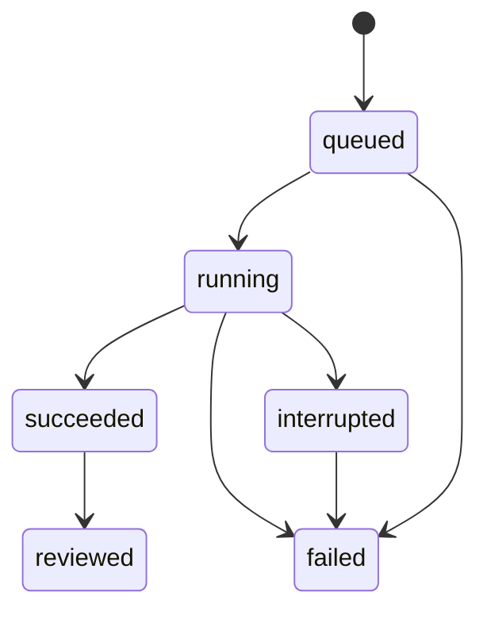
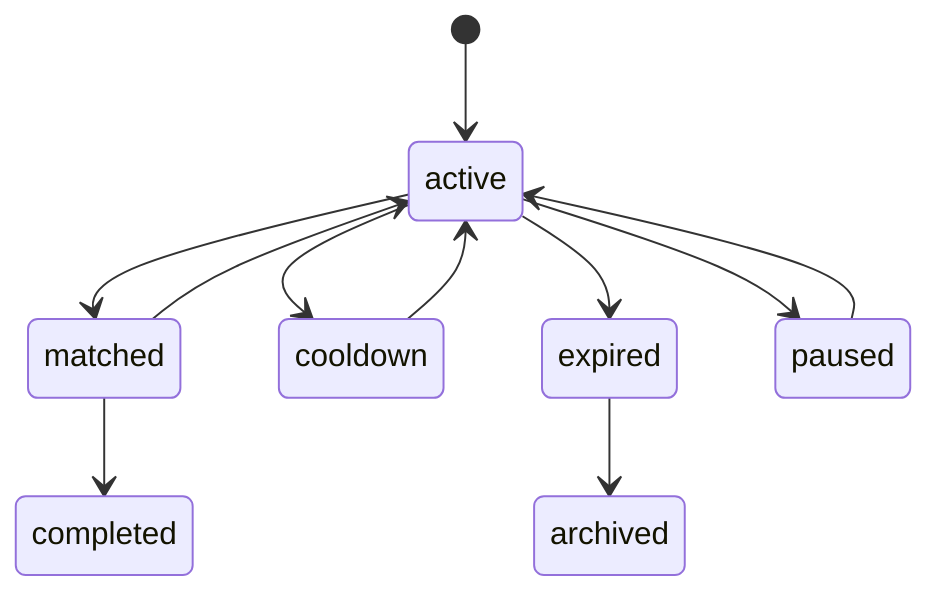
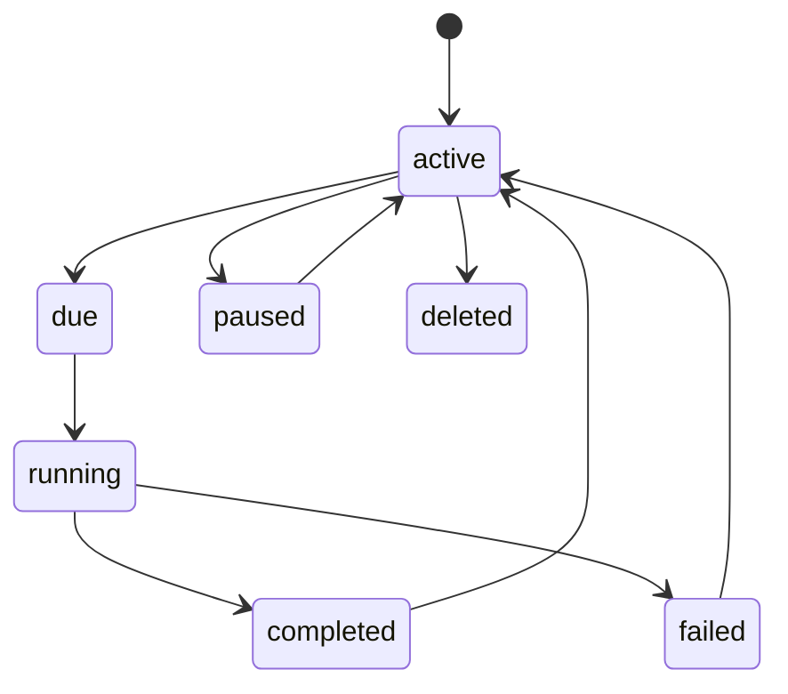
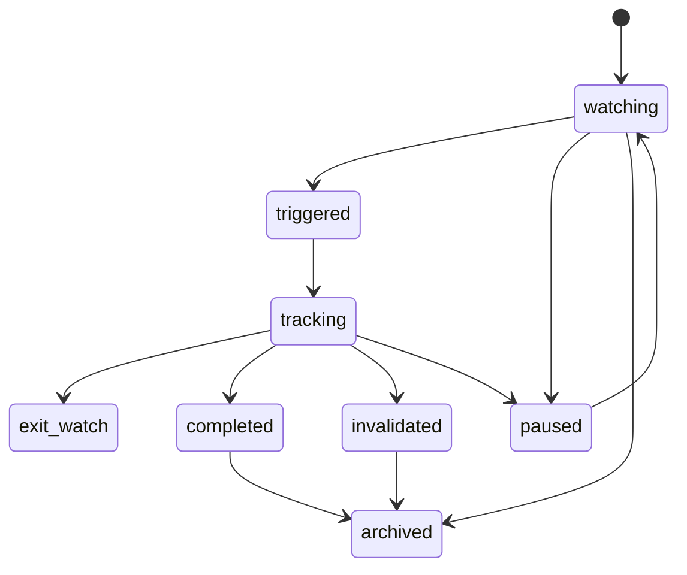
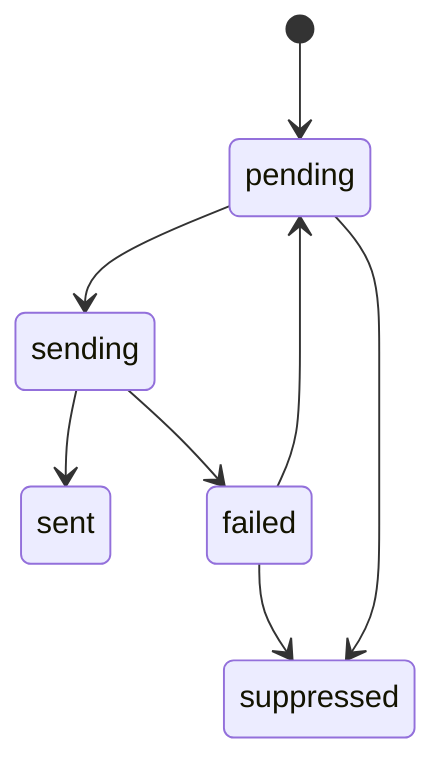
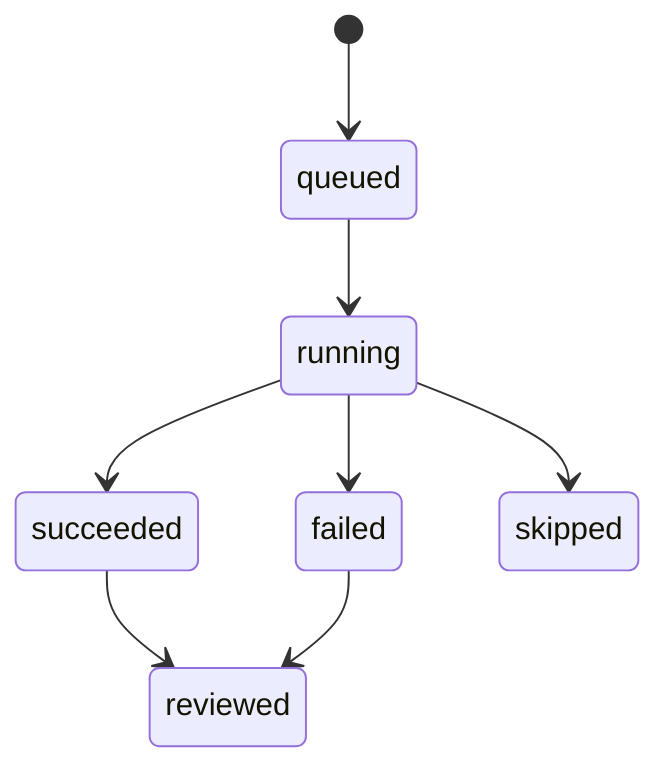
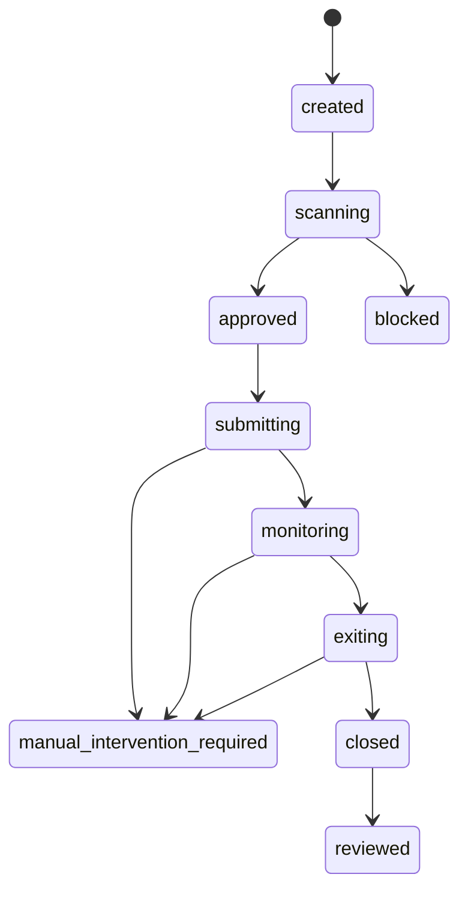
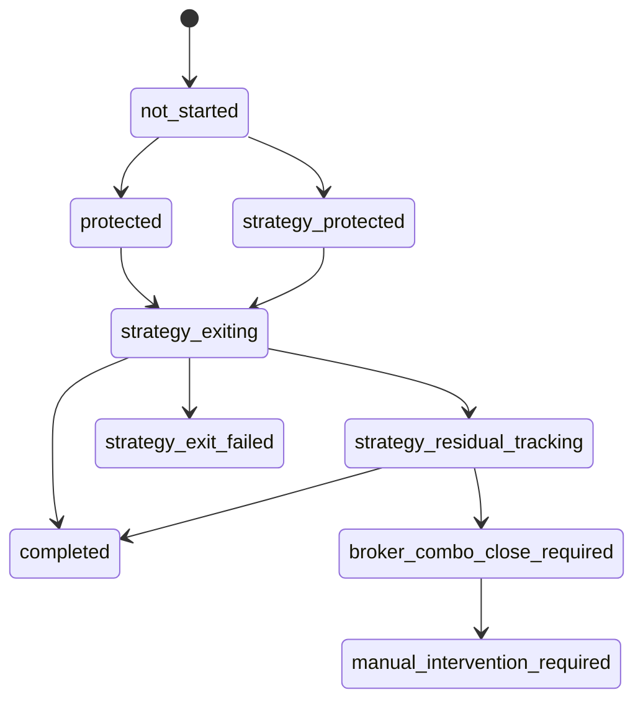

# Frontend State Machines

本文档定义前端需要显式展示和处理的状态机。重构时所有状态 badge、按钮可用性、轮询策略和提示文案应按本文档收敛。

## 1. 分析实例

| 状态 | UI 文案 | 前端行为 |
|---|---|---|
| `queued` | 待开始 | 轮询详情 |
| `running` | 进行中 | 轮询详情，显示 stage |
| `succeeded` | 已完成 | 停止轮询，展示结果 |
| `failed` | 失败 | 停止轮询，展示错误 |
| `interrupted` | 已中断 | 展示中断提示，可重试 |
| `reviewed` | 已复盘 | 展示复盘标记 |

按钮规则：

- `queued/running`：禁止重复提交同一表单。
- `succeeded`：允许创建 Trigger、星标、笔记。
- `failed`：允许查看错误和重新发起扫描。

## 2. Wait Trigger

| 状态/条件 | UI 文案 | 说明 |
|---|---|---|
| enabled true | 启用 | 会被调度检查 |
| enabled false | 暂停 | 不检查 |
| cooldown | 冷却中 | 命中后暂不重复通知 |
| expired | 已过期 | 超过 `expires_at` |
| max count reached | 已达上限 | 达到最大触发次数 |
| matched | 已触发 | 本次检查命中 |

前端规则：

- 测试规则 `test` 不增加触发次数，不发通知。
- 手动检查 `check` 可能发通知并写机会事件。
- Trigger 绑定 opportunity 时，详情页必须显示回链。

## 3. 循环扫描实例

| 状态 | UI 文案 | 前端行为 |
|---|---|---|
| `active` | 运行中 | 显示下次检查或最近运行 |
| `paused` | 已暂停 | 不显示为 due |
| deleted | 已删除 | 从列表移除 |

运行 item 的业务决策：

| 决策 | UI 文案 | 按钮建议 |
|---|---|---|
| `observe` | 观察 | 可创建观察机会 |
| `trigger` | 触发 | 可打开机会/通知 |
| `track` | 追踪 | 展示关联机会 |
| `exit` | 退出 | 标红风险或失效 |
| `review` | 复核 | 可手动 run now / AI 精扫 |

AI 剧本报告状态：

| 状态 | UI 文案 |
|---|---|
| generated | AI 已重写 |
| cached | 沿用上一轮 |
| suppressed | 本轮未调用 AI |
| unavailable | 数据不足 |

## 4. 机会实例

推荐状态文案：

| 状态 | UI 文案 | 说明 |
|---|---|---|
| `watching` | 观察中 | 机会还未触发 |
| `triggered` | 已触发 | 达到入场或提醒条件 |
| `tracking` | 追踪中 | 正在跟踪后续变量 |
| `exit_watch` | 退出观察 | 接近退出或失效 |
| `completed` | 已完成 | 机会生命周期结束 |
| `invalidated` | 已失效 | thesis 失效 |
| `paused` | 已暂停 | 暂停 follow-up |
| `archived` | 已归档 | 不再主动跟踪 |

前端规则：

- paused 不等同 archived。
- invalidated 必须显示失效原因。
- follow-up 检查结果应进入事件时间线。

## 5. 通知事件

| 状态 | UI 文案 | 前端行为 |
|---|---|---|
| `pending` | 待发送 | 可手动处理 |
| `sending` | 发送中 | 禁止重复点击 |
| `sent` | 已发送 | 展示投递日志 |
| `failed` | 失败 | 展示错误，可重试 |
| `suppressed` | 已抑制 | 展示冷却/限额原因 |

投递日志状态：

- `succeeded`：请求成功。
- `failed`：外部平台返回错误或网络错误。

## 6. 交易实例

顶层状态机：

生命周期状态机：

保护状态机：

UI 组合规则：

| 条件 | 主文案 | Tone |
|---|---|---|
| `stage=strategy_partial_execution` | 部分执行 | warning |
| `protection_state=strategy_residual_tracking` | 残腿追踪 | warning |
| `protection_state=strategy_exit_failed` | 退出失败 | danger |
| `protection_state=broker_combo_close_required` | 需券商组合平仓 | danger |
| `lifecycle_state=manual_intervention_required` | 需人工处理 | danger |
| `lifecycle_state=closed` | 已结束 | ok |

重要规则：

- `status=failed` + `stage=strategy_partial_execution` 仍可能有真实持仓。
- 如果 `orders[].strategy_entry_order_ids` 非空，必须显示券商订单 ID。
- 如果 `orders[].entry_filled_quantity > 0`，必须显示已成交数量并进入风险追踪视图。
- 如果存在 `strategy_fill_ledger.has_fills=true`，必须显示 ledger，不可只显示顶层失败。

## 7. 订单状态

| 状态 | UI 文案 | 行为 |
|---|---|---|
| `submitted` | 买入已提交，保护已就绪 | 展示 order id |
| `failed` | 执行失败 | 展示错误 |
| `skipped_insufficient_allocation` | 资金不足跳过 | 不展示为失败订单 |
| `entry_submitted_stop_pending_unfilled` | 买单待成交 | 继续轮询 |
| `entry_partially_filled_stop_partial` | 部分成交，部分保护 | 显示未保护数量 |
| `stop_submitted_after_fill` | 已成交，保护已补齐 | 正常监控 |
| `entry_filled_stop_unsupported_paper` | 已成交，需软件保护 | 提示 paper 限制 |
| `software_stop_submitted` | 软件止损已触发 | 刷新成交 |
| `software_take_profit_submitted` | 止盈已触发 | 刷新成交 |
| `strategy_auto_exit_submitted` | 策略自动退出已提交 | 展示退出订单 |
| `strategy_residual_tracking` | 残腿追踪中 | 必须保留风险提示 |
| `broker_combo_close_required` | 券商要求组合平仓 | 人工处理 |

## 8. 智能退出状态

退出来源：

- 止损。
- 止盈。
- 分层止盈。
- 时间限制退出。
- 正股价格退出。
- Greeks 变化退出。
- AI 计划失效退出。
- 残腿追踪退出。

UI 展示要求：

- 每个退出条件显示监控变量、阈值、当前值、触发状态。
- AI 生成的退出条件标记为 `AI 风控`。
- 系统默认条件标记为 `系统默认`。
- 退出条件触发后必须显示提交到哪个 broker，以及券商 order id。

## 9. 轮询策略

| 对象 | 条件 | 前端频率 |
|---|---|---|
| 分析实例 | `queued/running` | `SCAN_POLL_INTERVAL_MS` |
| 交易实例 | `queued/running` | `TRADING_POLL_INTERVAL_MS` |
| 保护追踪 | 有软件止盈止损/智能退出/残腿追踪 | `PROTECTION_POLL_INTERVAL_MS` |
| 市场时钟 | 登录后 | 60 秒 |

说明：

- 前端轮询频率不是后端监控频率。
- 后端订单监控默认 `AI_OPTION_ORDER_MONITOR_INTERVAL_SECONDS=5`。
- 机会调度默认 `AI_OPTION_TRIGGER_MONITOR_SECONDS=30`。
